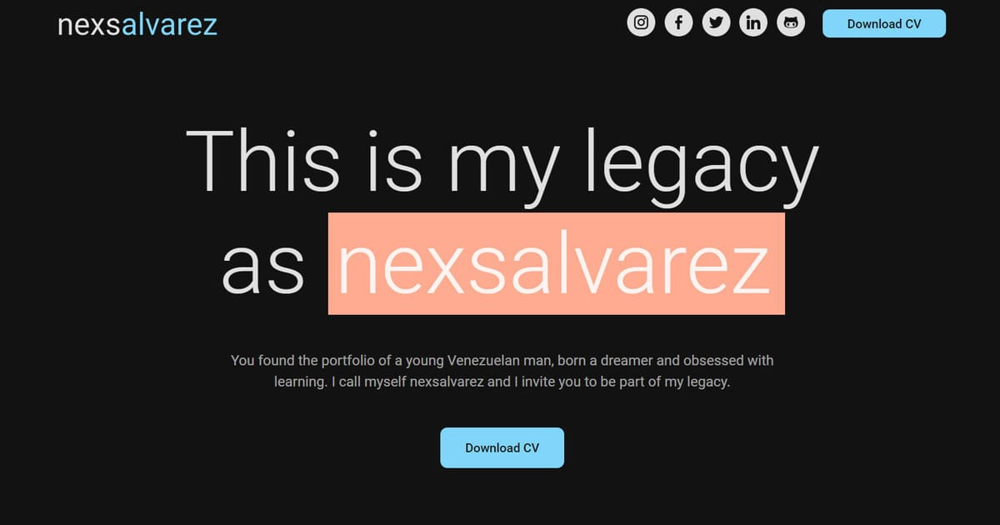

# Portfolio: nexsalvarez

My work projects are on the landing page that I developed as a portfolio, and here, in this repository, you can find the code.

## Intro

The structure of the landing page prioritizes the display of the projects, in a section where they can be filtered according to the type of work carried out:

- Personal projects
- Jobs at the agency ([Xodux Media](https://xoduxmedia.com/))
- Data projects

I started to carry out this project in the middle of December of the year 2022.

Live site: [nexsalvarez](https://nexsalvarez.com/)

## Technologies

As it is a simple landing page to show my projects as a frontend developer and data analyst, for its construction I used the basic technologies for frontend development:

- Semantic HTML5
- CSS3
- JavaScript

I did not use any frameworks or libraries, or any other specialized tool.

## Mentions

As special mentions to show my gratitude due to the contribution in this project, I can mention:

- [Xodux Media](https://xoduxmedia.com/)
- [Flaticon](https://www.flaticon.es/)
- [Unicons](https://www.flaticon.com/uicons)